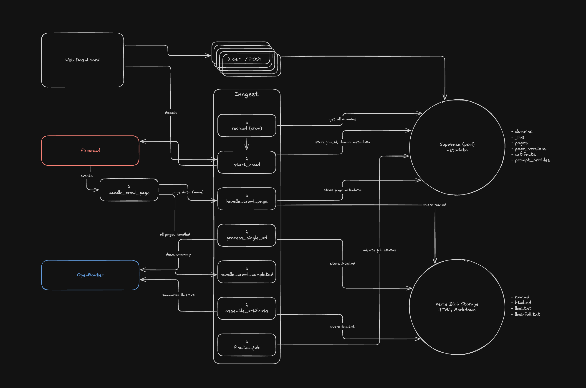

## Specs

- [Product Spec](./docs/product_spec_v0.md)
- [Tech Spec](./docs/tech_spec_v0.md)
- [Implementation](./docs/implementation_v0.md)
- [Inngest](./docs/inngest_v0.md)
- [Firecrawl](./docs/firecrawl_v0.md)
- [Change Detection](./docs/change_detection_v0.md)
- [Enhanced Generation](./docs/enhanced_generation_v0.md)
- [Front End](./docs/frontend_v0.md)

## Tech Diagram



## Infra Choices

I prioritize building it in a modular way where pieces of it could be upgraded to more scalable infrastructure, but the logic would generally stay the same. For instance, inngest can be upgraded to temporal, Supabase storage can be upgraded to S3, and Firecrawl can be upgraded to an internally built crawler with a similar interface. 

### The infra i chose and why:

### Vercel + Next.js
- fast devX
- I'm familiar with it
- it has a marketplace of easily pluggable services like Supabase and Inngest

### Supabase psql
- easy DevEx with Vercel and its locally running option

### Supabase Storage
- already using Supabase psql made itan easy choice over Vercel blob
- additionally, the interface can be mapped easily to S3

### Inngest
- Once I mapped out how many steps there were in the process, I knew I wanted a workflow runner, and Ingest is plug and play with Vercel and works really well with its serverless endpoints and has a cron option built in. The logic of it is similar to Temporal, so upgrading wouldn't require too much logic change, more just syntax change. 

### OpenRouter
- easy to compare different model output in the future based on quality of output and cost

### Firecrawl
- for its interface and ability to kick off a job and get webhook events, which fits nicely into our workflow runner
- built-in change diffing feature (turned off for now)
- cached pages feature with a max-age cache buster
- autoproxy option
- can return the raw web data as Markdown


## Local Development

<details>
<summary><b>First-time setup</b></summary>

**Quick Start (macOS)**

```bash
./init.sh
```

This script automatically:
- Checks and installs all dependencies:
  - Node.js 20+
  - pnpm
  - Docker
  - Supabase CLI
  - Cloudflare Tunnel
- Creates your empty `.env` file
- Installs project dependencies
- Creates an `artifacts` bucket on your local Supabase Storage
- Initializes database schema

</details>

<details>
<summary><b>Running services locally</b></summary>

**Option 1: Automated Start (Recommended)**

Run `./start.sh` to automatically:
- Start Cloudflare Tunnel and extract the public URL
- Update `FIRECRAWL_WEBHOOK_URL` in `.env` with the tunnel URL
- Start Inngest Dev Server in background
- Start Next.js dev server in foreground

Press Ctrl+C to stop all services. The script handles cleanup automatically.

```bash
./start.sh
```

**Option 2: Manual Start (See All Logs)**

Run each service in separate terminals to view all logs independently:

1) Supabase local stack

```bash
# If not already running
supabase start

# Inspect
supabase status
```

2) Cloudflare Tunnel for webhooks

```bash
cloudflared tunnel --url localhost:3000
# Copy the generated https://xxxxx.trycloudflare.com URL
# Manually update FIRECRAWL_WEBHOOK_URL in .env with:
# FIRECRAWL_WEBHOOK_URL="https://xxxxx.trycloudflare.com/api/webhooks/firecrawl"
```

3) Inngest Dev Server

```bash
pnpm dlx inngest-cli@latest dev
# Dev UI: http://localhost:8288
```

4) Next.js application

```bash
pnpm dev
```

</details>