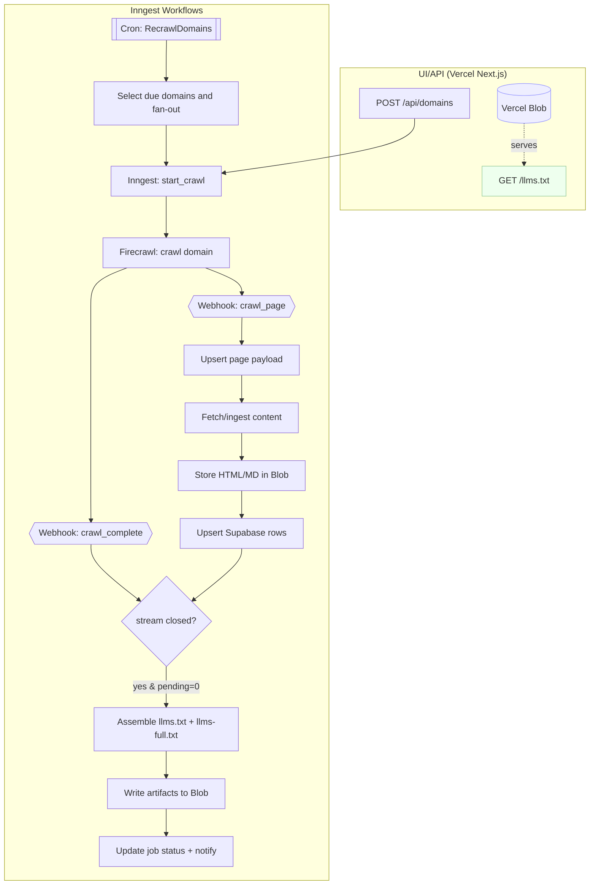

# llms.txt Generator & Updater — Technical Specification (v0)

## 1) Scope & Goals

**Goal:** Automatically generate and maintain `llms.txt` and `llms-full.txt` for a domain by crawling content, detecting changes, summarizing updated pages with an LLM, assembling artifacts, and notifying on completion.

**Primary capabilities (v0):**
- Crawl & extract site content; detect page deltas.  
- Summarize updated pages; assemble & serve `llms.txt` artifacts.  
- Track job state; notify on completion.

**Out of scope (v0):** llms.txt quality eval metrics, per-site prompt profiles, advanced semantic diffing, self-hosted crawler.

---

## 2) Architecture Overview

**Core stack (v0):**
- **App host/UI/API:** Next.js using PageRouter on Vercel.
- **Workflow orchestration:** Inngest (cron, fan-out, durable waits, retries, concurrency).
- **Crawl:** Firecrawl API + webhook on completion.
- **Summarization:** OpenRouter (parallel + throttled via Inngest concurrency).
- **Storage:**
  - Vercel Blob: raw HTML, `firecrawl_raw.md` (raw markdown), `html.md` (cleaned snapshot), `llms.txt`, `llms-full.txt`.
  - Supabase Postgres: domain/page/job metadata, diffs, artifact pointers.
- **Notification:** Email (e.g., Resend).

**High-level flows:** New Domain + Update Domain as described in the PRD (steps 1–8 and 1–7).


---

## 3) Data Model (Postgres on Supabase)

> Designed for recurring jobs per domain and per URL, with versioning and “change-enough” skips.

### 3.1 Entity–Relationship (ER) sketch

- **domains (1) → jobs (N)**
- **jobs (1) → pages (N)** (snapshot of URLs considered in that job)
- **pages (1) → page_versions (N)**
- **jobs (1) → artifacts (N)**
- **prompt_profiles (N) referenced by domains** (soft versioning of prompts/configs)

### 3.2 Tables

```sql
-- Domains being managed
CREATE TABLE domains (
  id UUID PRIMARY KEY DEFAULT gen_random_uuid(),
  domain TEXT UNIQUE NOT NULL,                -- e.g. example.com
  check_interval_minutes INT NOT NULL DEFAULT 1440, -- how often to recrawl (per-domain)
  openrouter_model TEXT NOT NULL DEFAULT 'openai/gpt-4o-mini', -- per-domain model
  firecrawl_llms_txt_url TEXT,                -- optional parallel artifact pointer
  prompt_profile_id UUID REFERENCES prompt_profiles(id),
  is_active BOOLEAN NOT NULL DEFAULT TRUE,
  created_at TIMESTAMPTZ NOT NULL DEFAULT now(),
  updated_at TIMESTAMPTZ NOT NULL DEFAULT now()
);

-- Versioned prompt/config bundles; allows updates without code deploys
CREATE TABLE prompt_profiles (
  id UUID PRIMARY KEY DEFAULT gen_random_uuid(),
  name TEXT NOT NULL,
  summary_prompt TEXT NOT NULL,
  llms_txt_header TEXT,             -- optional header banner/comment
  assemble_template TEXT,           -- e.g., how to compose llms.txt / llms-full.txt
  params JSONB NOT NULL DEFAULT '{}',-- tuning knobs (temps, lengths, thresholds)
  version INT NOT NULL DEFAULT 1,
  created_at TIMESTAMPTZ NOT NULL DEFAULT now()
);

-- Crawl or update runs for a domain
CREATE TABLE jobs (
  id UUID PRIMARY KEY DEFAULT gen_random_uuid(),
  domain_id UUID NOT NULL REFERENCES domains(id),
  type TEXT NOT NULL CHECK (type IN ('initial','update')),
  status TEXT NOT NULL CHECK (status IN ('processing','finished','failed')),
  firecrawl_job_id TEXT,                       -- track upstream ID
  started_at TIMESTAMPTZ NOT NULL DEFAULT now(),
  finished_at TIMESTAMPTZ,
  stats JSONB NOT NULL DEFAULT '{}'            -- counts, durations, per-step stats
);

-- The set of URLs considered in a job
CREATE TABLE pages (
  id UUID PRIMARY KEY DEFAULT gen_random_uuid(),
  job_id UUID NOT NULL REFERENCES jobs(id) ON DELETE CASCADE,
  domain_id UUID NOT NULL REFERENCES domains(id),
  url TEXT NOT NULL,
  last_known_version_id UUID,                  -- pointer to the latest accepted version
  created_at TIMESTAMPTZ NOT NULL DEFAULT now()
);

-- Versioned content (even if "skipped" because not different-enough)
CREATE TABLE page_versions (
  id UUID PRIMARY KEY DEFAULT gen_random_uuid(),
  page_id UUID NOT NULL REFERENCES pages(id) ON DELETE CASCADE,
  job_id UUID NOT NULL REFERENCES jobs(id) ON DELETE CASCADE,
  url TEXT NOT NULL,
  html_blob_url TEXT,                          -- raw HTML snapshot (Blob)
  raw_md_blob_url TEXT,                        -- Firecrawl raw markdown (firecrawl_raw.md)
  html_md_blob_url TEXT,                       -- cleaned HTML-as-Markdown snapshot (html.md)
  content_fingerprint TEXT NOT NULL,           -- hash of cleaned DOM/text
  prev_fingerprint TEXT,
  similarity_score REAL,                       -- 0..1 (1 same). Used to decide skip/regenerate
  changed_enough BOOLEAN NOT NULL,             -- decision outcome
  reason TEXT,                                 -- e.g., "low – skipped", "threshold exceeded"
  created_at TIMESTAMPTZ NOT NULL DEFAULT now()
);

-- llms.txt & llms-full.txt artifacts for a job
CREATE TABLE artifacts (
  id UUID PRIMARY KEY DEFAULT gen_random_uuid(),
  job_id UUID NOT NULL REFERENCES jobs(id) ON DELETE CASCADE,
  kind TEXT NOT NULL CHECK (kind IN ('llms.txt','llms-full.txt','index.json')),
  version INT NOT NULL DEFAULT 1,               -- domain-level artifact version
  blob_url TEXT NOT NULL,
  created_at TIMESTAMPTZ NOT NULL DEFAULT now()
);

-- (Removed) Internal tasks table: We will rely on Inngest runs/steps via API for observability
```

**Indexes (suggested):**
- `domains(domain)`, `jobs(domain_id, started_at DESC)`, `pages(domain_id, url)`, `page_versions(page_id, created_at DESC)`, `page_versions(content_fingerprint)`

---

## 4) APIs & Boundaries

### 4.1 Next.js API Routes (Vercel)

- `POST /api/domains`
  - **Body:** `{ domain, promptProfileId?, openrouterModel?, checkIntervalMinutes? }`
  - **Effects:** create `domains` row; enqueue `start_crawl` Inngest job (type=`initial`).
- `POST /api/domains/{id}/update`
  - **Effects:** enqueue `start_crawl` (type=`update`).
- `GET /api/jobs/{id}`
  - **Returns:** job status, stats, artifact links.
- `POST /api/webhooks/firecrawl`
  - **Auth:** secret header; idempotent.
  - **Bodies:**
    - `crawl.page` → streamed page payload (example below)
    - `crawl.completed` → `{ firecrawlJobId, status }` (no `urls`)
- `GET /llms.txt`, `GET /llms-full.txt`
  - **Behavior:** 302 or streamed proxy to latest `artifacts.blob_url` for the domain.

### 4.2 Inngest Functions

- `start_crawl(jobId)`  
  - Calls Firecrawl crawl(domain); persists `firecrawl_job_id`; waits on webhook.
- `handle_firecrawl_complete(jobId)`  
  - Fan-out `process_url` for each URL.
- `process_url(jobId, url)`  
  - Fetch HTML (Firecrawl), store Blob, compute fingerprint; compare to last; if changed-enough → summarize via OpenRouter; upsert `page_versions`.
- `assemble_artifacts(jobId)`  
  - Compose `llms.txt` and `llms-full.txt` from latest accepted `page_versions`; upload to Blob; create `artifacts`.
- `finalize_job(jobId)`  
  - Update status to `finished` (or `failed`); send email notification.

**Cross-boundary notes:** Next.js ↔ Inngest; Inngest ↔ Supabase/Blob; Firecrawl ↔ Inngest (webhook); OpenRouter during summarize.

---

## 5) Job Lifecycle & State Machine

**States:** `processing` → `finished` | `failed` (with retries/backoff at step level).

**Transitions (happy path):**
1. Create job (`processing`) → Firecrawl started.  
2. Webhook received → per-URL tasks queued.  
3. All `process_url` done → `assemble_artifacts`.  
4. Artifacts written → `finished` + notify.

**Failure handling:** per-task retries (exponential), poison tasks mark `failed` with `last_error`; partial success still assembles from successful pages.

---

## 6) Diffing & “Changed Enough” Strategy

- **Fingerprint:** hash normalized DOM/text (strip scripts/nav, collapse whitespace).  
- **Compare:** similarity score from Jaccard/MinHash or simple cosine on shingles.  
- **Decision:** `changed_enough = similarity_score < threshold` (threshold in `prompt_profiles.params` for tunability).  
- **Skip path:** store a `page_versions` row with `changed_enough = false`, `reason = 'low – skipped'` to keep an audit trail.

> Note: advanced semantic diffing is out of scope for v0.

---

## 7) Concurrency, Throttling, and Cost Controls

- **Firecrawl:** 1 job per domain; per-URL work is fan-out but bounded by Inngest concurrency.
- **Scheduler:** RecrawlDomains is a cron-triggered Inngest function that fans out one `domain/ingest.requested` per active domain; do not constrain concurrency at the scheduler—use per-domain and global keys in the crawl functions.
- **OpenRouter:**  
  - **Global limit:** e.g., `MAX_SUMMARIES_GLOBAL = 50` concurrent.  
  - **Per-domain limit:** e.g., `MAX_SUMMARIES_PER_DOMAIN = 5`.  
  - **Queueing:** Inngest concurrency keys: `openrouter:global` and `openrouter:domain:{domainId}`.  
- **Backoff:** Exponential on 429/5xx from OpenRouter; jittered.

---

## 18) Scheduling (RecrawlDomains)

- Implement a cron-triggered Inngest function `RecrawlDomains` that:
  - Loads active domains from Postgres and selects those due: `now() - last_finished_at >= check_interval_minutes`.
  - Emits one `domain/ingest.requested` per due domain using `step.sendEvent()`.
  - Optionally batches/micro-sleeps to smooth spikes.
- Concurrency is enforced downstream (per-domain=1 via `firecrawl:domain:{domainId}`, plus a global cap like 5).
- Prefer Inngest native schedules over external schedulers; use Vercel Cron only if required.

## 8) Domain-Level Configuration & Prompt Versioning

- **Per-domain config:**  
  - `check_interval_minutes`, `openrouter_model`, `prompt_profile_id`, optional `firecrawl_llms_txt_url`.
- **Prompt/profile:** `prompt_profiles` table stores prompts, templates, thresholds; rolling forward by creating a new profile and re-pointing `domains.prompt_profile_id` (no code deploy).

---

## 9) Assembly Logic (llms.txt & llms-full.txt)

- **Inputs:** latest accepted `page_versions` per URL for the domain.  
- **llms.txt:** concise, curated entries (URL, title, short LLM summary).  
- **llms-full.txt:** exhaustive entries (longer summaries at the domain level; may reference `.html.md` for raw content).  
- **Templates:** stored in `prompt_profiles.assemble_template` (adjustable without deploy).  
- **Outputs:** uploaded to Vercel Blob; API routes serve/proxy the latest.

---

## 10) Notifications

- **Email on success/failure** with job stats, counts of: pages changed, skipped, summarized, and artifact URLs.

---

## 11) Observability & Ops

- **Structured logs:** per task with correlation IDs (`jobId`, `pageId`, `url`).  
- **Metrics:** counters for pages processed, summaries generated, avg latency per step.  
- **Dashboards:** simple Next.js admin page showing job timeline, per-URL outcomes.

---

## 12) Security & Compliance

- **Webhooks:** HMAC signature validation + idempotency.  
- **Secrets:** Vercel env vars for Firecrawl/OpenRouter/Resend.  
- **Access:** Admin UI gated by auth provider of choice (e.g., Supabase Auth).

---

## 13) Deployment & Environments

- **Envs:** dev / staging / prod on Vercel; separate Supabase projects & Blob namespaces.  
- **Migrations:** SQL via Supabase migrations.  
- **Feature flags:** profile-driven (no-deploy prompt & threshold changes).

---

## 14) Testing Strategy

- **Unit:** assembly functions, fingerprint/diff.  
- **Integration:** mock Firecrawl/OpenRouter; execute Inngest functions end-to-end.  
- **E2E smoke:** seed small site → expect artifacts + email.

---

## 15) Open Questions / Future Work (post-v0)

- Per-site prompt “archetypes” (blog, docs, e-com).  
- Semantic diffs/embeddings for smarter “changed-enough.”  
- Self-hosted crawler for cost control.

---

## 16) Appendix: Example Inngest Concurrency Keys

- `openrouter:global` (max 50)  
- `openrouter:domain:{domainId}` (max 5)  
- `firecrawl:domain:{domainId}` (max 1 active crawl)

---

## 17) Webhook Payloads (Firecrawl)

### 17.1 `crawl.page` (page-level streaming)

Example payload:

```json
{
  "success": true,
  "type": "crawl.page",
  "id": "550e8400-e29b-41d4-a716-446655440000",
  "data": [
    {
      "markdown": "# Welcome to our website\n\nThis is the main content of the page...",
      "metadata": {
        "title": "Page Title",
        "description": "Page description",
        "url": "https://example.com/page",
        "statusCode": 200,
        "contentType": "text/html",
        "scrapeId": "550e8400-e29b-41d4-a716-446655440001",
        "sourceURL": "https://example.com/page",
        "proxyUsed": "basic",
        "cacheState": "hit",
        "cachedAt": "2025-09-03T21:11:25.636Z",
        "creditsUsed": 1
      }
    }
  ],
  "metadata": {}
}
```

Handling notes:
- Treat `metadata.url` as the canonical URL key; dedupe on `{ jobId, url, scrapeId }`.
- Persist `data[].markdown` to Blob as `firecrawl_raw.md` (raw markdown). During processing, we clean to `html.md` (no nav/header/footer). Summarization produces `.pagename.md` used in `llms.txt`.
- If both `crawl.page` and `crawl.completed` are used, the former streams early results; the latter can still drive final fan-out for any missing URLs.

---

## 18) Admin UI: /jobs (Backed by Inngest API)

- Purpose: Surface running and recent jobs without persisting a local tasks table.
- Data source: Inngest Cloud API (runs, steps/timeline, logs) using our Inngest API key.
- Correlation: Include `jobId` and `pageId` in event `data` when sending events so they appear in runs/steps.
- UI behavior:
  - GET `/jobs` server-side fetch: list latest runs filtered by our function names; show status, started_at, duration.
  - Drill-in: link to a job detail view that fetches the run timeline/steps; display step names and any errors.
  - Deep-links: provide a link out to the Inngest dashboard run detail.
- Security: guard under admin auth; call Inngest API server-side only.
- Pagination & Filtering: by domain, status, time window, function name.

Example event send with IDs embedded:

```ts
await inngest.send({
  name: "domain/crawl.page",
  data: { jobId, pageId, url }
});
```
